# PRT addon

PRT add-on for Fiddler classic and extender for Burp Suite (Community & Professional editions).

## Burp Suite

### Installation

Download binaries [here](https://github.com/secureworks/primary-refresh-token-viewer/releases/download/Release/Burp.Extender.zip).

1. Create a folder and copy **PRT.jar** and **gson-2.9.0.jar** to it:

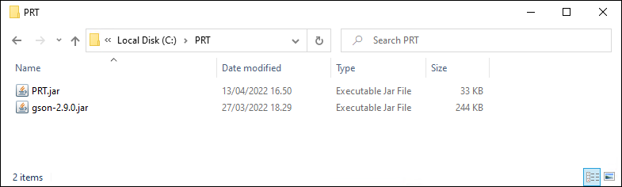

2. Open Burp Suite and select Extender tab:

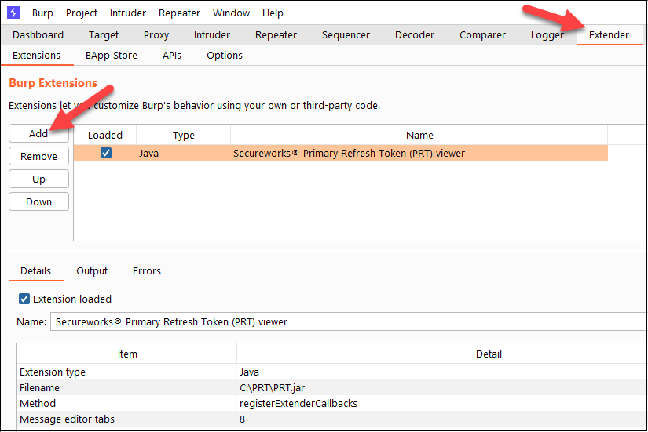

3. Set Java Environment JAR folder to the folder created above (or copy gson-2.9.0.jar to the currently selected folder)

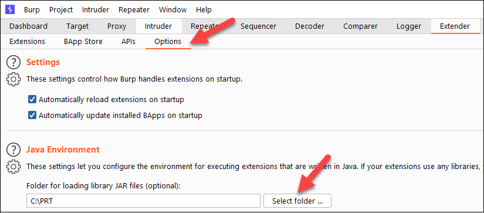

### Usage

1. Select a response that contains any information the PRT extender can display. Open the **Select extension** dropdown list and select **PRT**

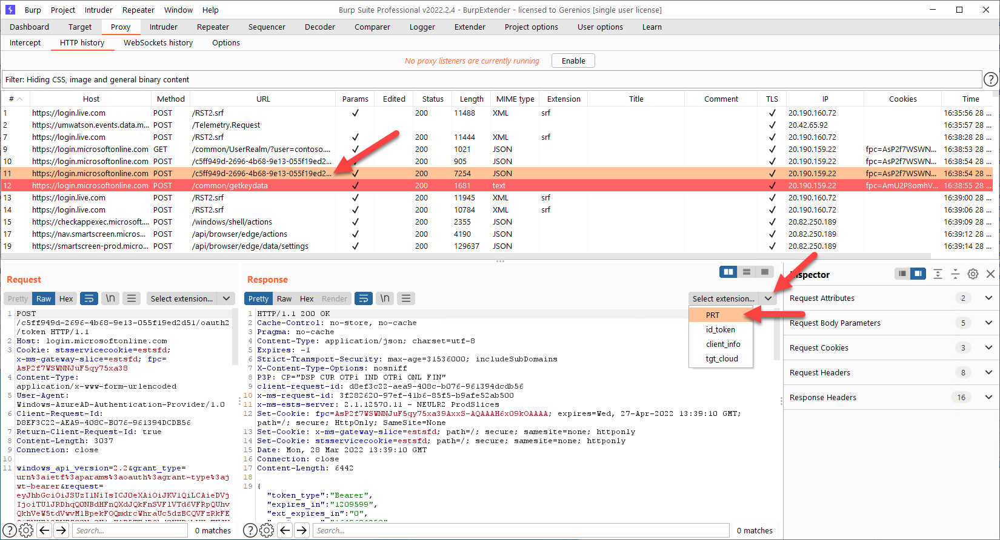

2. Click **Select** and choose the .PEM file containing transport key (tkpriv) of the target device.

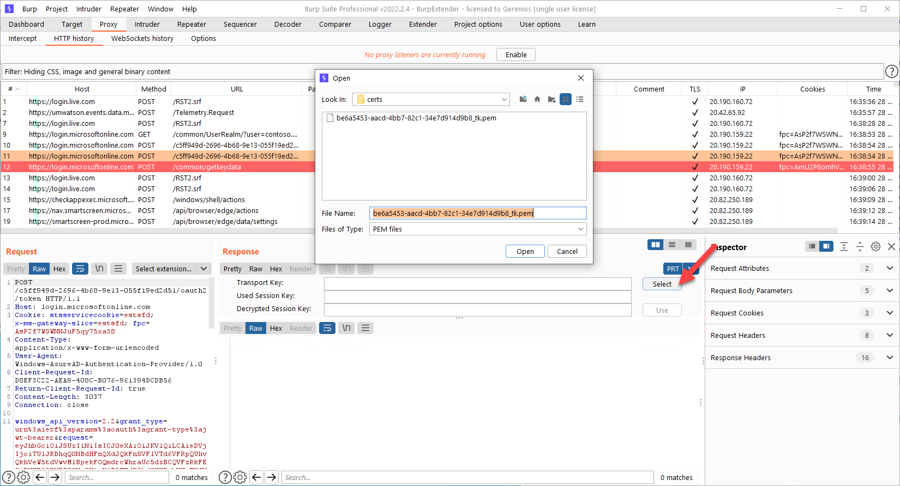

3. Select a response containing "session_key_jwt". If you have a correct transport key, the session key is decrypted. Click **Use** to start using the decrypted key.

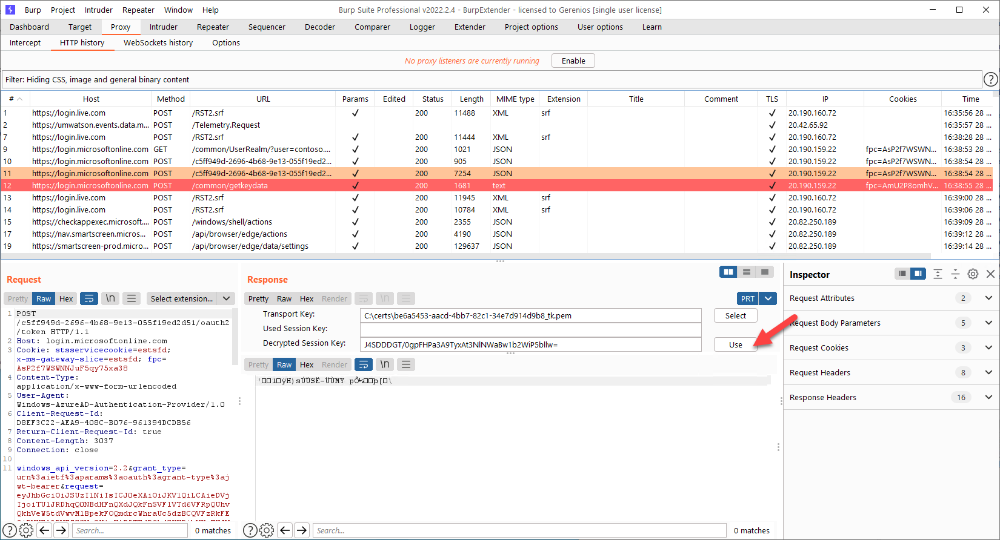

4. Select any response containing data encrypted with the session key.

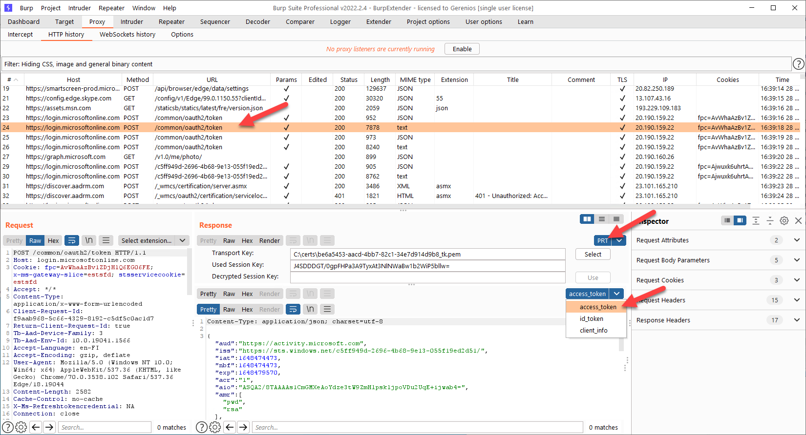

## Fiddler classic

### Installation
Download binaries [here](https://github.com/secureworks/primary-refresh-token-viewer/releases/download/Release/Fiddler.Classic.zip).

Copy **Secureworks.dll** and **BouncyCastle.Crypto.Dll** to **%LOCALAPPDATA%\Programs\Fiddler\Inspectors** folder:

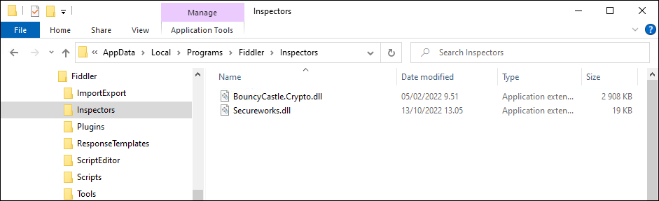

### Usage

1. Switch to Inspectors tab

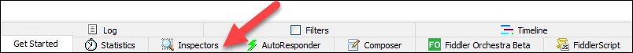

2. Select a response that contains any information the PRT inspector can display and switch to PRT tab. 

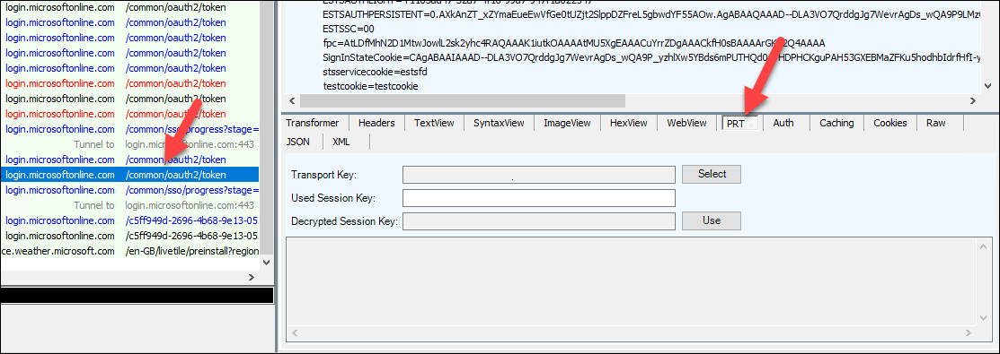

3. Click **Select** and choose the .PEM file containing transport key (tkpriv) of the target device.

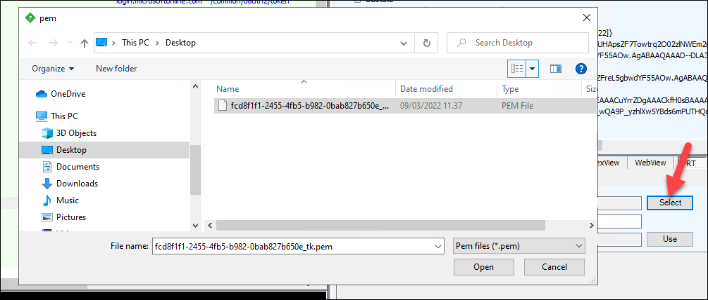

4. Select a response containing "session_key_jwt". If you have a correct transport key, the session key is decrypted. Click **Use** to start using the decrypted key.

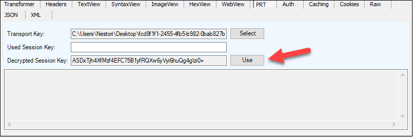

5. Select any response containing data encrypted with the session key to view decrypted data:

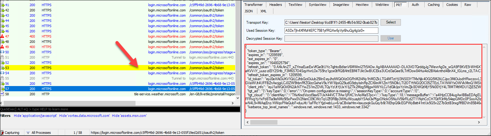
